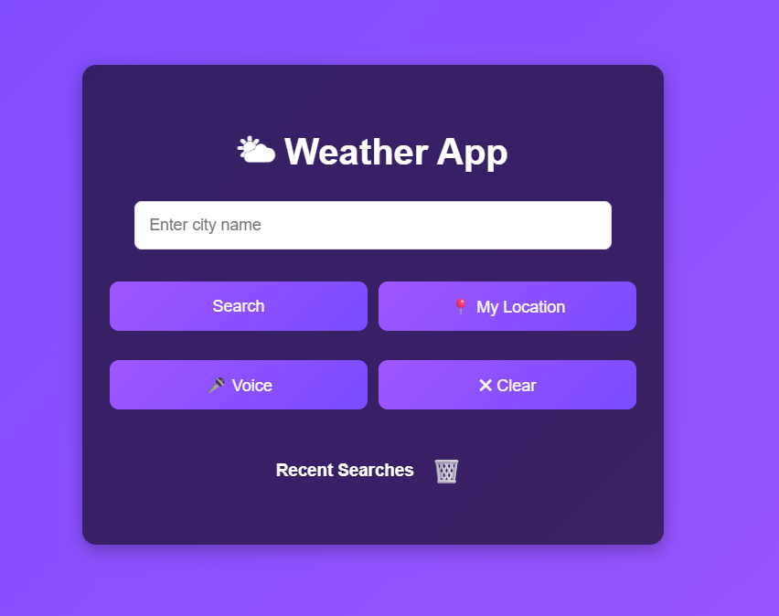
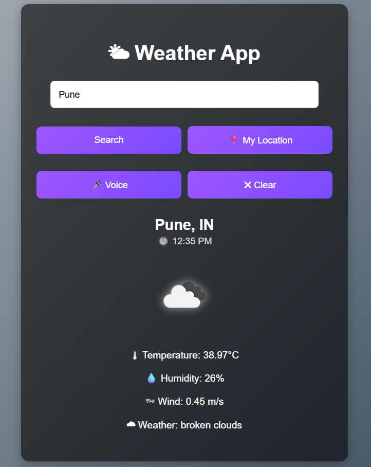

# 🌦️ Advanced Weather App


## 📌 Overview

A modern and interactive **Weather Application** built using **HTML, CSS, and JavaScript** that provides real-time weather updates for any city worldwide using the **OpenWeatherMap API**.

This project goes beyond a basic weather app by offering a polished user experience with smart features such as **voice search, current location weather, live city time, dynamic weather backgrounds, search history, toast notifications, and responsive design**.

---

## ✨ Features

### 🌍 Weather Information

* Real-time weather data for any city
* Current temperature in Celsius
* Weather condition with icon
* Humidity level
* Wind speed
* Country details

### 🎯 Smart Functionalities

* 📍 **Current Location Weather** using Geolocation API
* 🎤 **Voice Search** for city names
* 🕒 **Live City Time** based on searched location timezone
* 🔎 **Enter Key Support** for faster search
* 🗂️ **Recent Search History** using Local Storage
* 🧹 **Clear Search / Reset** option
* 🗑️ **Clear Search History**

### 🎨 UI / UX Enhancements

* 🌤️ Dynamic background based on weather condition
* Toast notifications for loading, success, and errors
* Responsive layout for desktop and mobile devices
* Smooth transitions and modern glassmorphism-inspired design

---

## 🛠️ Technologies Used

* **HTML5**
* **CSS3**
* **JavaScript (ES6)**
* **OpenWeatherMap API**
* **Browser Geolocation API**
* **Web Speech API**

---

```md
## 📸 Screenshots




```

---

## 🚀 How to Run the Project

1. Clone the repository:

```bash
git clone https://github.com/aartisingh07/Weather-App.git
```

2. Open the project folder.

3. Run `index.html` in your browser
   **or** use Live Server in VS Code.

---

## 🔑 API Setup

This project uses the OpenWeatherMap API.

1. Create a free account at:
   https://openweathermap.org/api

2. Generate your API key

3. Replace:

```javascript
YOUR_API_KEY
```

with your own key in `weather.js`

---

## 📂 Project Structure

```bash
weather-app/
│── index.html
│── style.css
│── weather.js
│── README.md
```

---

## 🌟 Future Improvements

* 5-Day Forecast
* AQI (Air Quality Index)
* Temperature Toggle (°C / °F)
* Favorite Cities
* Animated Weather Effects

---

## 👩‍💻 Author

Developed by **Aarti**

---

## 📜 License

This project is open-source and free to use.